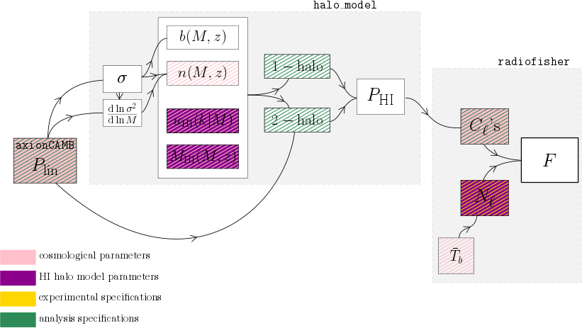

****21cm Intenstiy Mapping with axionCAMB****

This code calculates the Fisher matrices for a given 21cm intensity mapping experiment, including the axion fraction as forecasted parameter. Its general structure is based on the [bao21cm](https://gitlab.com/radio-fisher/bao21cm) code from [Bull et al. (2015)](https://arxiv.org/abs/1405.1452), though it differs conceptionally in calculating the angular power spectra, instead of the 3D comoving power spectrum in the flat sky limit.

To get this code running, you need to have a running [axionCAMB](https://github.com/dgrin1/axionCAMB) version installed. Change the `CAMB_EXEC` to the directory of your axionCAMB executable. 
It is recommended to run this code with the `mpi4py`-package if one is interested to scan many surveys (and axion masses).  

Generally, the code works as follows:  

  1. An input file needs to be passed to the full_experiment_inifile.py, containing all the relevant information: the fiducial cosmological and astrophysical parameters (except N_eff = 3.046, which is hard-coded), as well as the experimental and analysis specifications (except \Delta_z, which is hard-coded). 
This input file is read in as dictionaries, called `cosmo` for the cosmological parameters, while the experimental and analysis specifications are contained in the `expt` and `analysis_specifications` dictionary, respectively.  
  2. Secondly, the redshift range of the survey is divided into redshift bins with width \Delta z and the Fisher matrix for each redshift bin is calculated. Since each redshift bin is independent of the other (in the Limber approximation), this procedure was allowed to be run in parallel.
  3. Thirdly, the resulting Fisher matrix for the redshift bin is saved, as well as the fiducial C_\ell and \Delta C_\ell.  

The sketch visualizes the pipeline to calculate the Fisher matrix of one redshift bin. `halo_model` and `radiofisher` are modules computing the quantities inside the boxes.  

 
